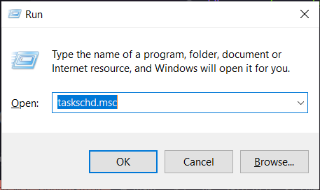
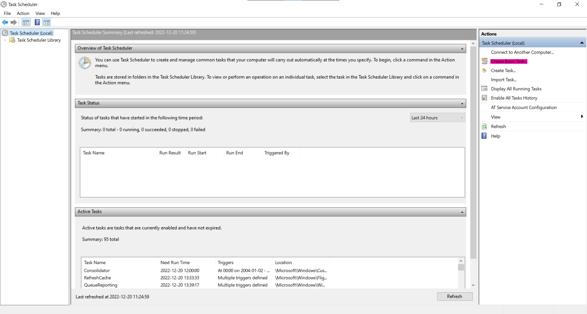
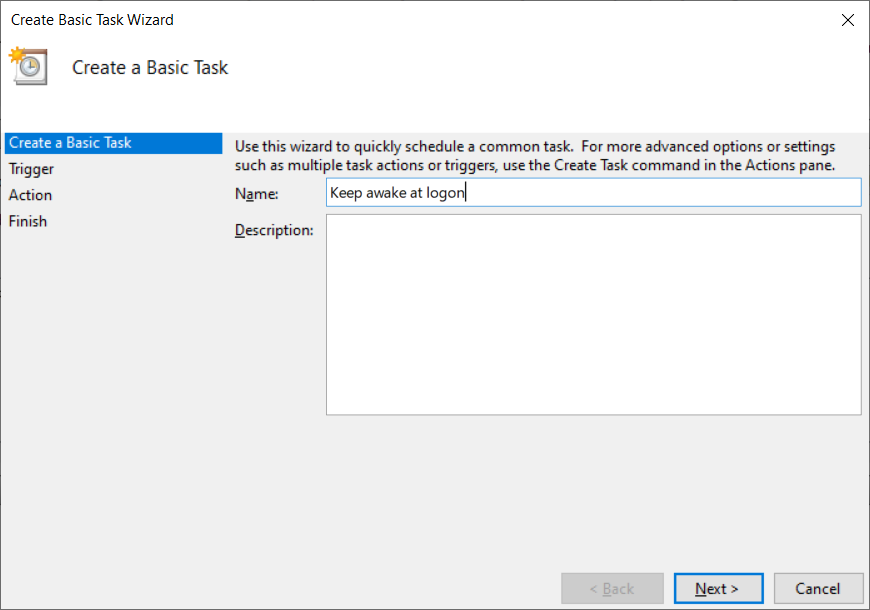
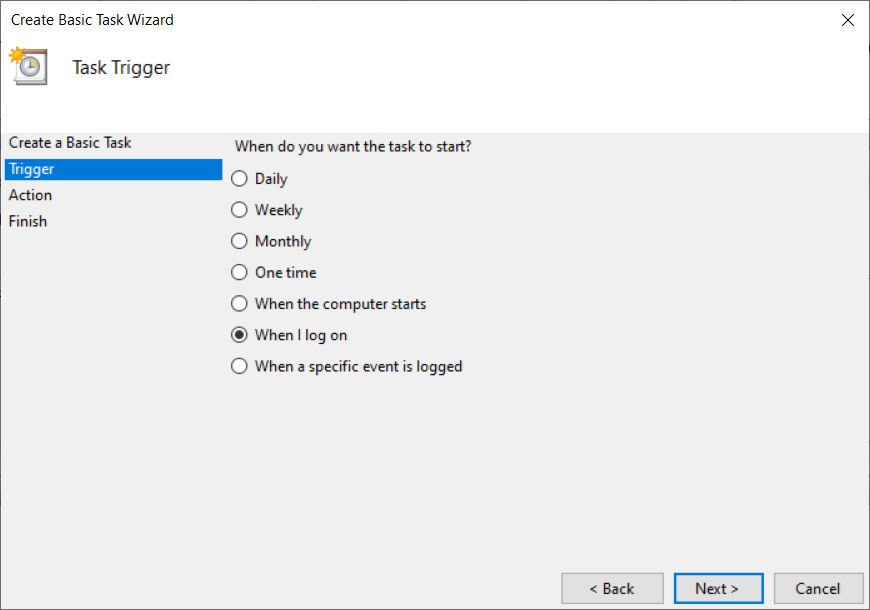
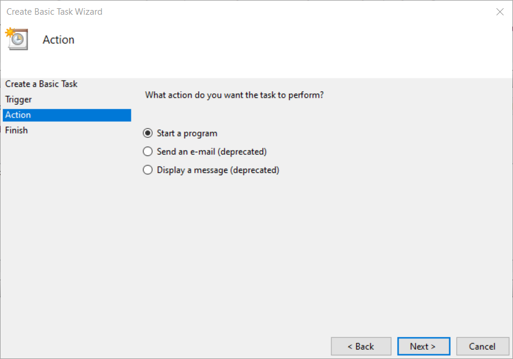
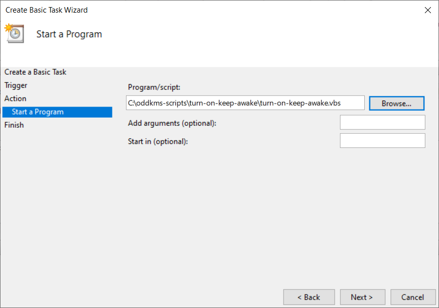

# Turn on PowerToys Awake

## What it does:

This is a simple .vbs script that calculates how long it is until the workday is over (17:00), and sets that as startup parameters for [Microsoft PowerToys Awake](https://learn.microsoft.com/en-us/windows/powertoys/awake). It'll keep your screen on and prevent your computer from going to sleep during work hours. Just remember to Win+L when you're away!

## How to use:

First, download and install [Microsoft PowerToys](https://github.com/microsoft/PowerToys). They're really handy, and "Fancy Zones" that's also included in the package makes window management infinitely better and more customizable. But I digress.

1. Clone the repo into a folder of your liking.
2. Open up [Task Scheduler](https://learn.microsoft.com/en-us/windows/win32/taskschd/task-scheduler-start-page). (Win+R, type in "taskschd. msc", press Enter)

   

3. Click "Create Basic Task".

   

4. Give your task a fitting name and click "Next"

   

5. For the trigger, select "When I log on"

   

6. Select "Start a program" as the action to be performed.

   

7. Browse to- and select the script in the folder you cloned earlier.

   

8. On the next screen you'll see a summary of the task. Click the "Finish" button and you're all set! The script will now be executed every time you log on to the computer and will keep it awake until it's time to shut down and head home.

9. Treat yourself to a nice cold beer, you've earned it!
